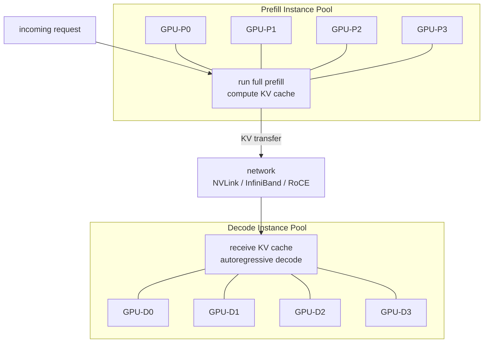
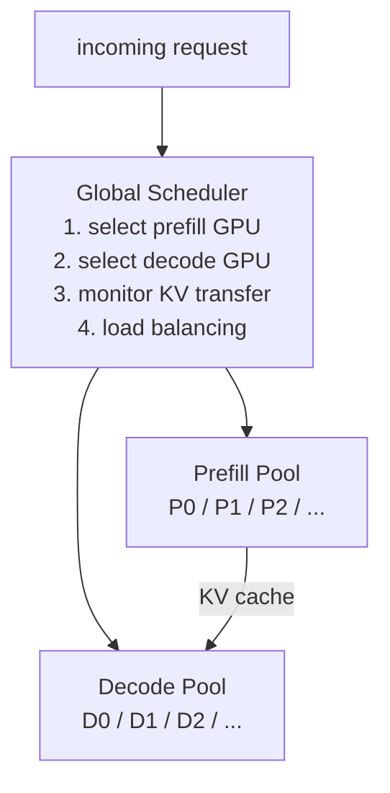

## why same-GPU coexistence has a ceiling {#ceiling}

[chunked prefill]() makes prefill-decode coexistence more tolerable by slicing the prefill into small pieces. but even with perfect chunking, prefill and decode are still *sharing the same GPU*. they compete for:

- **HBM bandwidth** — both need to read from and write to GPU memory each iteration
- **compute units** — prefill's GEMM and decode's GEMV contend for the same tensor cores
- **KV cache space** — prefill temporarily occupies blocks that could serve decode requests

at moderate scale, this coexistence is acceptable. at large scale — thousands of requests/second, strict SLOs, multi-GPU clusters — the competition becomes a bottleneck that chunking alone cannot resolve.

## the fundamental asymmetry {#asymmetry}

step back and look at what prefill and decode actually need from the hardware:

| property | prefill | decode |
|---|---|---|
| operation type | GEMM — matrix × matrix | GEMV — vector × matrix |
| compute bottleneck | compute-bound (tensor cores) | memory-bandwidth-bound |
| arithmetic intensity | high — \\(\sim O(L \cdot d)\\) FLOP/byte | very low — \\(\sim O(1)\\) FLOP/byte |
| ideal GPU MFU (model FLOP utilization) | 50–70% | 5–15% |
| KV cache lifetime | transient — computed, then handed off | persistent — grows with every generated token |
| sensitivity to batch size | low — throughput scales with \\(L\\) already | high — larger batch amortizes the per-step bandwidth cost |

the two workloads want opposite things. prefill wants to compute aggressively on large matrices and doesn't care much about its KV cache footprint (it'll be done soon). decode wants a large concurrent batch to amortize bandwidth, and needs a stable, long-lived KV cache.

**forcing them to share a GPU means neither gets what it wants.**

## disaggregated prefill: the architecture {#architecture}

the solution: route prefill and decode to *different* GPU instances.

the flow for a single request:

1. a prefill instance receives the request and runs the prompt through a full forward pass, producing the KV cache and the first generated token
2. the KV cache is transferred to a decode instance over the network
3. the decode instance takes over and runs autoregressive generation until EOS

from the decode instance's perspective, it receives a ready-to-use KV cache and immediately starts generating — it never touches a prefill workload again.

## why this helps each side {#benefits}

**prefill instances** can now:
- run at maximum compute utilization without decode traffic disrupting memory bandwidth
- handle longer prompts without worrying about KV cache lifetime (KV is handed off immediately)
- use tensor parallelism aggressively — prefill is embarrassingly parallel over the prompt tokens

**decode instances** can now:
- maintain a much larger concurrent batch (all requests are decode-only), fully utilizing HBM bandwidth
- keep KV cache layout stable and compact — no interleaving with short-lived prefill KV blocks
- apply [prefix caching]() within the decode pool without interference

**both SLO metrics decouple:**

| metric | mixed (chunked prefill) | disaggregated |
|---|---|---|
| TTFT | limited by prefill queue on shared GPU | controlled by prefill pool sizing |
| TPOT | affected by prefill chunks sharing iteration | isolated — decode never sees prefill |

once disaggregated, you optimize TTFT by adding prefill instances, and TPOT by adding decode instances. the two knobs no longer conflict.

## the engineering challenge: KV cache migration {#migration}

the elephant in the room: transferring the KV cache from a prefill instance to a decode instance is expensive.

### how much data moves? {#data-volume}

for a model with \\(L\\) layers, \\(n_h\\) KV heads, head dim \\(d_h\\), and BF16 precision:

\begin{equation}
\text{KV bytes per token} = 2 \times L \times n_h \times d_h \times 2
\end{equation}

for LLaMA-3 70B (GQA: \\(L = 80\\), \\(n_h = 8\\), \\(d_h = 128\\)):

\begin{equation}
2 \times 80 \times 8 \times 128 \times 2 = 327{,}680 \text{ bytes} \approx 320 \text{ KB per token}
\end{equation}

| prompt length | KV cache to transfer |
|---|---|
| 1K tokens | ~320 MB |
| 8K tokens | ~2.5 GB |
| 32K tokens | ~10 GB |

this is *per request*. at 100 requests/second with 4K-token prompts, the cluster needs to sustain ~100 GB/s of KV transfer.

### network bandwidth requirements {#bandwidth}

assume a prefill pool sustaining 10K tokens/second throughput:

\begin{equation}
\text{required bandwidth} = 10{,}000 \times 320 \text{ KB} = 3.2 \text{ GB/s}
\end{equation}

how different interconnects compare:

| interconnect | bandwidth | sufficient? |
|---|---|---|
| NVLink (same-node multi-GPU) | ~900 GB/s | trivially — not a bottleneck |
| InfiniBand HDR (200 Gb/s) | ~25 GB/s | yes, with headroom |
| RoCE (100 GbE) | ~12.5 GB/s | borderline at high concurrency |
| standard Ethernet (10 GbE) | ~1.25 GB/s | insufficient |

the practical conclusion: **same-node disaggregation (NVLink) is essentially free; cross-node disaggregation requires InfiniBand or RoCE with RDMA**. ordinary ethernet cannot sustain the transfer rate at production scale.

### pipelining the transfer {#pipelining}

naively, the prefill instance completes all \\(L\\) layers, then transfers the entire KV cache. the decode instance waits for the full transfer before generating the first token.

this adds \\(T_{\text{transfer}}\\) to TTFT:

\begin{equation}
\text{TTFT} = T_{\text{prefill}} + T_{\text{transfer}} + T_{\text{decode\_queue}}
\end{equation}

the optimization: **pipeline the transfer layer by layer**. as soon as layer \\(l\\) finishes on the prefill instance, transfer its KV slice immediately — overlapping transfer with the remaining prefill computation for layers \\(l+1, \ldots, L\\):



with perfect pipelining, \\(T_{\text{transfer}}\\) overlaps with \\(T_{\text{prefill}}\\) and adds only a small residual latency. in practice, the overlap is imperfect (RDMA setup overhead, layer size granularity), but even partial overlap substantially reduces effective TTFT.

## global scheduler design {#scheduler}

disaggregated architectures need a **global scheduler** that coordinates both pools:

key scheduling decisions:

**prefill instance selection**: route requests to the prefill instance with the shortest queue. prefill throughput is predictable (proportional to prompt length), so load can be estimated ahead of time.

**decode instance selection**: route to the decode instance with the most available KV cache space *and* that is topologically close to the selected prefill instance (minimizing transfer distance).

**KV cache affinity**: if the decode instance already has a cached prefix that matches this request's prompt, route to that instance to reuse the cached blocks — avoiding transfer for the cached portion entirely.

## independent scaling: the key architectural advantage {#scaling}

the core economic argument for disaggregation is elastic, independent scaling.

in a mixed architecture, to handle a 2× increase in either prefill or decode load, you must scale the entire cluster — even if only one side is the bottleneck.

with disaggregation, you scale each pool independently:

| load pattern | optimal configuration |
|---|---|
| long prompts, short outputs | more prefill instances, fewer decode |
| short prompts, long outputs | fewer prefill, more decode |
| balanced | roughly equal pools |
| burst of new requests | scale prefill temporarily |

**observed ratios from production systems**: the Splitwise paper (Microsoft, 2024) analyzed real Azure LLM traffic and found the optimal prefill:decode instance ratio is approximately **1:3**. one prefill instance can serve three decode instances before becoming the bottleneck — reflecting that decode is the longer phase for typical generation lengths.

## real systems {#real-systems}

### DistServe (2024)

systematically analyzed optimal parallelism strategies for each pool:

- **prefill instances** prefer **tensor parallelism** — a single long prompt benefits from splitting the attention computation across GPUs within the same forward pass
- **decode instances** prefer **pipeline parallelism** — many concurrent short decode steps benefit from pipelining across GPU stages, which reduces the all-gather communication overhead per token

DistServe's key finding: the optimal strategy for each phase differs, so letting them share a GPU forces a suboptimal compromise.

### Mooncake (Kimi, 2024)

introduced a **KVCache-centric** architecture treating the KV cache as a first-class distributed object:

- prefill instances write KV to a distributed KV store (accessed via RDMA)
- decode instances read directly from the store, bypassing CPU
- prefix caching works *across* the distributed store — a cached prefix computed on P0 can be reused by a request routed to P1 without re-transfer

Mooncake effectively turns KV cache management into a distributed storage problem, with all the consistency and locality optimizations that implies.

### Splitwise (Microsoft, 2024)

validated disaggregation on real production traffic (Microsoft Azure):

- for long-prompt workloads: TTFT reduced by **90%+**
- for long-generation workloads: throughput improved by **2×+**
- optimal prefill:decode ratio: approximately **1:3**

## the separation-of-concerns principle {#separation}

there is a deeper pattern here. throughout computer systems, forcing heterogeneous workloads to share resources leads to mutual degradation. the solution is always the same: identify the resource requirements of each workload, and give each workload resources matched to its needs.

- databases: read replicas vs. write-primary
- CPU pipelines: in-order vs. out-of-order execution units
- network: control plane vs. data plane separation
- LLM serving: prefill (compute-bound) vs. decode (memory-bound)

disaggregated prefill is the application of this principle to LLM inference. the cost is coordination: KV cache must be serialized, transferred, and deserialized — adding a new failure mode and latency component. but when the cluster is large enough and the network is fast enough, the coordination overhead is small relative to the gains from running each workload at its optimal operating point.

## summary {#summary}

disaggregated prefill takes the next logical step after [chunked prefill](): instead of interleaving prefill and decode on the same GPU, separate them onto dedicated pools.

the payoff:
- **TTFT and TPOT decouple** — each is now an independent variable controlled by pool sizing
- **each pool runs at its optimal operating point** — prefill at high compute utilization, decode with large batch sizes saturating HBM bandwidth
- **independent, cost-efficient scaling** — add prefill capacity for long prompts, decode capacity for long outputs, independently

the cost:
- **KV cache migration** across the network — requires InfiniBand or RDMA for cross-node transfers at production scale
- **global scheduler** complexity — must coordinate two pools, manage KV affinity, and handle transfer failures
- **increased operational complexity** — two pools to monitor, tune, and autoscale independently

at moderate scale, chunked prefill is the pragmatic choice. at large scale with strict SLOs, disaggregation is increasingly the industry direction — as evidenced by Kimi (Mooncake), Azure (Splitwise), and the broader adoption in production serving stacks.
