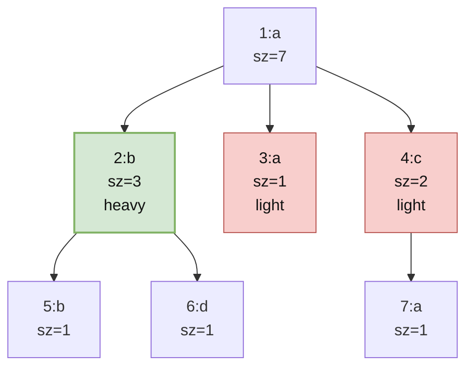
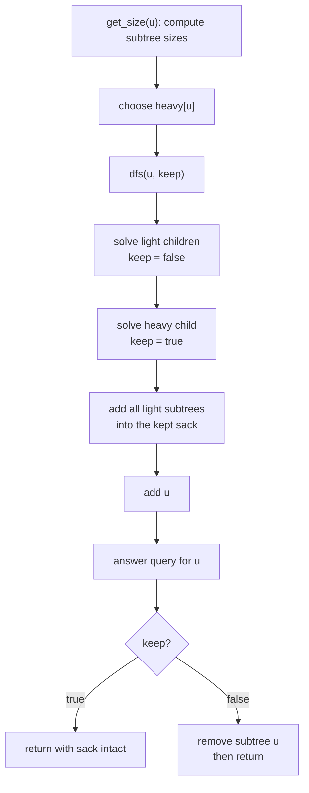

## the subtree-query problem {#problem}

suppose every vertex of a rooted tree has a color. for every vertex \\(v\\), we want to answer:

> how many distinct colors appear in the subtree of \\(v\\)?

a direct DFS for every query works, but it is too expensive. if we scan the whole subtree of each vertex independently, a chain of \\(n\\) vertices already costs

\begin{equation}
1 + 2 + \cdots + n = O(n^2).
\end{equation}

the problem is not that subtree aggregation is hard. the problem is that we keep throwing away work. when computing the answer for a parent, most of the information from its children has already been computed.

**DSU on tree**, also called **sack**, is a way to reuse that work for all subtree queries in about \\(O(n \log n)\\) time. despite the name, it is not the union-find data structure. the name comes from the same spirit: maintain a bag of information and merge small bags into large bags.

## the core idea {#idea}

for a node \\(u\\), split its children into:

- the **heavy child**: the child with the largest subtree
- **light children**: all other children

when answering queries for \\(u\\), we do this:

1. solve all light children first, but discard their temporary counts afterwards
2. solve the heavy child and **keep** its counts
3. add all vertices from the light children's subtrees into the kept counts
4. add \\(u\\) itself
5. answer the query for \\(u\\)
6. if the caller does not want to keep this subtree, remove all vertices in \\(u\\)'s subtree

the heavy child's data becomes the base "sack" for the parent. all smaller child sacks are poured into it.

why keep the heavy child? because it is the largest piece. rebuilding small pieces is cheaper than rebuilding large pieces. this is the same intuition behind small-to-large merging: always move elements from the smaller container into the larger one, so an element cannot be moved too many times.

## a concrete example {#example}

consider this rooted tree. node `2` is the heavy child of `1` because it has the largest subtree:



the subtree sizes are:

```text
sz[2] = 3, sz[3] = 1, sz[4] = 2, sz[1] = 7
```

so the heavy child of `1` is `2`.

when processing `1`:

- process `3` and discard its count `{a: 1}`
- process `4` and discard its count `{c: 1, a: 1}`
- process `2` and keep its count `{b: 2, d: 1}`
- add the light subtree `3`, giving `{b: 2, d: 1, a: 1}`
- add the light subtree `4`, giving `{b: 2, d: 1, a: 2, c: 1}`
- add node `1`, giving `{b: 2, d: 1, a: 3, c: 1}`

therefore the answer for node `1` is `4`: colors `a`, `b`, `c`, and `d`.

the important detail is that the largest child `2` was not rebuilt when answering `1`. we kept it and only replayed the smaller parts.

## the algorithm shape {#algorithm}

there are usually two DFS passes.



the first pass computes subtree size and heavy child:

```c++
void get_size(int u, int p) {
  sz[u] = 1;
  heavy[u] = -1;

  for (int v : g[u]) {
    if (v == p) continue;
    get_size(v, u);
    sz[u] += sz[v];
    if (heavy[u] == -1 || sz[v] > sz[heavy[u]]) {
      heavy[u] = v;
    }
  }
}
```

the second pass maintains one global data structure representing the current sack. for the distinct-color problem, this is just `cnt[color]` plus a number `distinct`.

```c++
void dfs(int u, int p, bool keep) {
  for (int v : g[u]) {
    if (v == p || v == heavy[u]) continue;
    dfs(v, u, false);        // light children: compute, then clear
  }

  if (heavy[u] != -1) {
    dfs(heavy[u], u, true);  // heavy child: compute and keep
  }

  for (int v : g[u]) {
    if (v == p || v == heavy[u]) continue;
    add_subtree(v, u, +1);   // pour light subtrees into the heavy sack
  }

  add_vertex(u, +1);
  ans[u] = distinct;

  if (!keep) {
    add_subtree(u, p, -1);   // clear the whole subtree before returning
  }
}
```

the `keep` flag is the whole trick:

- `keep = true`: leave this subtree's contribution in the global sack for the parent
- `keep = false`: remove it before returning, so sibling subtrees do not pollute each other

## full implementation {#implementation}

this implementation answers "number of distinct colors in every subtree." colors are coordinate-compressed so `cnt` can be a vector instead of a hash map.

```c++
#include <bits/stdc++.h>
using namespace std;

struct DSUOnTree {
  int n;
  vector<vector<int>> g;
  vector<int> color, sz, heavy, ans, cnt;
  int distinct = 0;

  DSUOnTree(int n, vector<int> color)
      : n(n),
        g(n),
        color(std::move(color)),
        sz(n),
        heavy(n, -1),
        ans(n) {}

  void add_edge(int u, int v) {
    g[u].push_back(v);
    g[v].push_back(u);
  }

  void compress_colors() {
    vector<int> vals = color;
    sort(vals.begin(), vals.end());
    vals.erase(unique(vals.begin(), vals.end()), vals.end());

    for (int &c : color) {
      c = lower_bound(vals.begin(), vals.end(), c) - vals.begin();
    }
    cnt.assign(vals.size(), 0);
  }

  void get_size(int u, int p) {
    sz[u] = 1;
    heavy[u] = -1;

    for (int v : g[u]) {
      if (v == p) continue;
      get_size(v, u);
      sz[u] += sz[v];

      if (heavy[u] == -1 || sz[v] > sz[heavy[u]]) {
        heavy[u] = v;
      }
    }
  }

  void add_vertex(int u, int delta) {
    int c = color[u];

    if (delta == 1) {
      if (cnt[c] == 0) ++distinct;
      ++cnt[c];
    } else {
      --cnt[c];
      if (cnt[c] == 0) --distinct;
    }
  }

  void add_subtree(int u, int p, int delta) {
    add_vertex(u, delta);

    for (int v : g[u]) {
      if (v == p) continue;
      add_subtree(v, u, delta);
    }
  }

  void dfs(int u, int p, bool keep) {
    for (int v : g[u]) {
      if (v == p || v == heavy[u]) continue;
      dfs(v, u, false);
    }

    if (heavy[u] != -1) {
      dfs(heavy[u], u, true);
    }

    for (int v : g[u]) {
      if (v == p || v == heavy[u]) continue;
      add_subtree(v, u, +1);
    }

    add_vertex(u, +1);
    ans[u] = distinct;

    if (!keep) {
      add_subtree(u, p, -1);
    }
  }

  vector<int> solve(int root = 0) {
    compress_colors();
    get_size(root, -1);
    dfs(root, -1, true);
    return ans;
  }
};

int main() {
  ios::sync_with_stdio(false);
  cin.tie(nullptr);

  int n;
  cin >> n;

  vector<int> color(n);
  for (int &c : color) cin >> c;

  DSUOnTree solver(n, color);
  for (int i = 0; i < n - 1; ++i) {
    int u, v;
    cin >> u >> v;
    --u;
    --v;
    solver.add_edge(u, v);
  }

  vector<int> ans = solver.solve(0);
  for (int x : ans) cout << x << '\n';
}
```

## why the complexity is \\(O(n \log n)\\) {#complexity}

the first DFS is clearly \\(O(n)\\). the interesting part is the second DFS.

a vertex can be re-added only when it lies inside a light subtree of some ancestor. if a vertex \\(x\\) is in a light child subtree of node \\(u\\), then that light subtree has size at most half of \\(u\\)'s subtree:

\begin{equation}
sz[\text{light child}] \le \frac{sz[u]}{2}.
\end{equation}

otherwise it would be larger than the heavy child.

so every time \\(x\\) is charged as part of a light subtree while climbing toward the root, the containing subtree size at least doubles. starting from size \\(1\\), it can double at most \\(\log_2 n\\) times before reaching \\(n\\). therefore each vertex is added through `add_subtree` at most \\(O(\log n)\\) times.

that gives:

\begin{equation}
T(n) = O(n \log n)
\end{equation}

for the general sack pattern.



some implementations use an Euler tour and skip the heavy subtree when adding light subtrees. for simple per-vertex add/remove operations, the total work is still bounded by the same small-to-large argument. the Euler-tour version is often faster in practice because adding a whole subtree becomes a tight loop over a contiguous interval.



## what can the sack store? {#what-to-store}

the sack can store any information that supports:

- `add_vertex(u)`: include one vertex
- `remove_vertex(u)`: remove one vertex, if `keep = false` cleanup is needed
- `answer(u)`: read the current aggregate for subtree \\(u\\)

common examples:

- number of distinct colors in each subtree
- the most frequent color in each subtree
- sum of colors whose frequency is maximum
- count of colors appearing at least \\(k\\) times in each subtree
- offline subtree queries where each query asks about the current multiset of colors

for example, Codeforces 600E asks for the sum of colors with maximum frequency in each subtree. the sack stores:

- `cnt[color]`: frequency of a color
- `sum[f]`: sum of colors whose frequency is exactly `f`
- `max_freq`: largest current frequency

then `answer(u)` is simply `sum[max_freq]`.

## common pitfalls {#pitfalls}

**forgetting to skip the heavy child while adding light subtrees.** after `dfs(heavy[u], u, true)`, the heavy subtree is already inside the sack. adding it again corrupts all counts.

**using stale data after a `keep = false` call.** a light child's answer is recorded before cleanup. after it returns, the global sack should be empty again with respect to that subtree.

**thinking this is union-find.** DSU on tree is a DFS scheduling trick. there is no `find`, no parent compression, and no dynamic connectivity.

**using it for path queries.** DSU on tree is naturally for subtree queries. path queries usually want heavy-light decomposition, binary lifting, Mo's algorithm on trees, or another tool.

## summary {#summary}

DSU on tree works because it chooses what to keep:

- compute light children first and clear them
- compute the heavy child last and keep it
- rebuild only the light subtrees when answering the parent
- clear the current subtree only when the parent does not need it

the broader principle is small-to-large merging. whenever you repeatedly merge many containers and each element is expensive to move, make the largest container survive. then each element can only move across logarithmically many size doublings.

that is the real idea behind the sack.
