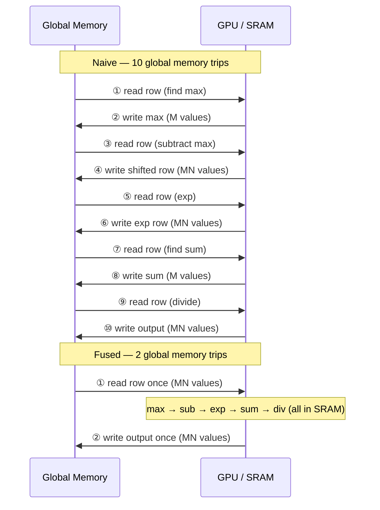

## introduction {#introduction}

softmax is one of the most ubiquitous operations in deep learning. it appears in attention mechanisms, classification heads, and anywhere we need to normalize a vector into a probability distribution.

the softmax function for a vector \\(x\\) of length \\(N\\) is:

\begin{equation}
\text{softmax}(x_i) = \frac{\exp(x_i - \max(x))}{\sum_{j=1}^{N} \exp(x_j - \max(x))}
\end{equation}

we subtract \\(\max(x)\\) for **numerical stability** — without it, \\(\exp(x_i)\\) can overflow for large \\(x_i\\).

for a matrix of shape \\(M \times N\\), softmax is applied **row-wise**. this means each of the \\(M\\) rows is independently normalized.

## the memory bottleneck {#memory-bottleneck}

a naive PyTorch implementation decomposes softmax into several separate operations:

```python
def naive_softmax(x):
    """x: shape (M, N)"""
    x_max = x.max(dim=1)[0]          # read MN, write M
    z = x - x_max[:, None]           # read MN + M, write MN; `None` reshapes (M,) to (M,1) for row-wise broadcasting
    numerator = torch.exp(z)         # read MN, write MN
    denominator = numerator.sum(dim=1)  # read MN, write M
    return numerator / denominator[:, None]  # read MN + M, write MN
```

total memory traffic: **\\(5MN + 2M\\) reads and \\(3MN + 2M\\) writes**. each intermediate result is written to global memory and read back again.

a **fused** kernel can reduce this to just **\\(MN\\) reads and \\(MN\\) writes** — a theoretical 4x reduction in memory traffic. the idea is simple: keep each row in GPU SRAM (shared memory / L2 cache), perform all computations on it, and write the result back once.

<span class="figure-number">Figure 1: </span>memory access comparison — naive softmax makes multiple trips to global memory, while fused softmax processes each row entirely in fast on-chip memory



## the triton kernel {#triton-kernel}

triton makes it straightforward to write fused kernels. the key insight: assign each GPU thread block to one or more rows, load the entire row into SRAM, compute max, exp, and sum in registers, then write back.

```python
import triton
import triton.language as tl

@triton.jit
def softmax_kernel(
    output_ptr,
    input_ptr,
    input_row_stride,
    output_row_stride,
    n_rows,
    n_cols,
    BLOCK_SIZE: tl.constexpr,
    num_stages: tl.constexpr,
):
    # each program instance handles one or more rows
    row_start = tl.program_id(0)
    row_step = tl.num_programs(0)

    # iterate over assigned rows (grid-stride loop for n_rows > num_programs)
    for row_idx in tl.range(row_start, n_rows, row_step, num_stages=num_stages):
        # pointer to the beginning of this row
        row_start_ptr = input_ptr + row_idx * input_row_stride

        # column offsets: we assume BLOCK_SIZE >= n_cols (padded to power of 2)
        col_offsets = tl.arange(0, BLOCK_SIZE)
        input_ptrs = row_start_ptr + col_offsets

        # load the row, masking out-of-bounds columns
        mask = col_offsets < n_cols
        row = tl.load(input_ptrs, mask=mask, other=-float("inf"))

        # --- step 1: numerical stability ---
        row_minus_max = row - tl.max(row, axis=0)

        # --- step 2: exponentiate ---
        numerator = tl.exp(row_minus_max)

        # --- step 3: normalize ---
        denominator = tl.sum(numerator, axis=0)
        softmax_output = numerator / denominator

        # write result
        output_row_start_ptr = output_ptr + row_idx * output_row_stride
        output_ptrs = output_row_start_ptr + col_offsets
        tl.store(output_ptrs, softmax_output, mask=mask)
```

the kernel processes each row in three phases — **max**, **exp**, and **sum** — all performed on data resident in fast on-chip memory. no intermediate results are written to global memory.

## kernel launch and occupancy tuning {#kernel-launch}

the wrapper function computes optimal launch parameters based on the matrix shape and hardware characteristics:

```python
import torch

def softmax(x):
    n_rows, n_cols = x.shape
    y = torch.empty_like(x)

    # BLOCK_SIZE must be >= n_cols, rounded up to power of 2
    BLOCK_SIZE = triton.next_power_of_2(n_cols)

    # tuning parameters
    num_warps = 8
    num_stages = 4  # use 2 if shared memory is limited

    # warmup to get register / shared memory usage
    kernel = softmax_kernel.warmup(
        y, x, x.stride(0), y.stride(0),
        n_rows, n_cols,
        BLOCK_SIZE=BLOCK_SIZE,
        num_stages=num_stages,
        num_warps=num_warps,
        grid=(1,),
    )

    # calculate occupancy: how many blocks fit on one SM?
    # n_regs: registers used per thread
    # size_smem: shared memory used per block
    occupancy = min(
        NUM_REGS // (n_regs * WARP_SIZE * num_warps),
        SIZE_SMEM // size_smem,
    )

    # total programs = number of SMs * occupancy, capped at n_rows
    num_programs = min(NUM_SM * occupancy, n_rows)

    # launch the kernel
    kernel[(num_programs, 1, 1)](
        y, x, x.stride(0), y.stride(0),
        n_rows, n_cols, BLOCK_SIZE, num_stages,
    )
    return y
```



the key optimization here is **occupancy**: by launching enough thread blocks to fully occupy all streaming multiprocessors (SMs), we ensure the GPU keeps executing work while some blocks wait for memory.



## why fusion works {#why-fusion-works}

the speedup comes from eliminating redundant memory traffic, not from faster arithmetic. to understand this, consider the memory bandwidth bottleneck:

| metric | naive PyTorch | fused Triton |
|---|---|---|
| **global memory reads** | \\(5MN + 2M\\) | \\(MN\\) |
| **global memory writes** | \\(3MN + 2M\\) | \\(MN\\) |
| **total traffic** | \\(8MN + 4M\\) | \\(2MN\\) |

for large matrices, the factor approaches **4x**. GPU compute units are fast — the bottleneck is almost always memory bandwidth, not FLOPs.

## performance results {#performance-results}

benchmarking on an \\(M = 4096\\) row matrix with varying column sizes:

<span class="figure-number">Figure 2: </span>performance comparison across different column sizes — triton fused softmax consistently outperforms both naive and torch.softmax implementations

```chart
{
    "type": "line",
    "data": {
        "labels": ["256", "1024", "4096", "16384", "65536", "262144"],
        "datasets": [
            {
                "label": "Naive PyTorch",
                "data": [20, 40, 65, 80, 95, 100],
                "borderColor": "#e05252",
                "backgroundColor": "transparent",
                "borderWidth": 2,
                "pointRadius": 4
            },
            {
                "label": "torch.softmax",
                "data": [12, 22, 40, 55, 70, 78],
                "borderColor": "#f0a500",
                "backgroundColor": "transparent",
                "borderWidth": 2,
                "pointRadius": 4
            },
            {
                "label": "Triton Fused",
                "data": [5, 10, 18, 25, 32, 38],
                "borderColor": "#4caf50",
                "backgroundColor": "transparent",
                "borderWidth": 2,
                "pointRadius": 4
            }
        ]
    },
    "options": {
        "title": {
            "display": true,
            "text": "Softmax Performance (M = 4096 rows)"
        },
        "scales": {
            "xAxes": [{"scaleLabel": {"display": true, "labelString": "Matrix columns (N)"}}],
            "yAxes": [{"scaleLabel": {"display": true, "labelString": "Time (us) — lower is better"}, "ticks": {"min": 0}}]
        }
    }
}
```

key findings:

- triton is approximately **4x faster** than the naive torch JIT implementation
- triton outperforms `torch.softmax` across most matrix sizes
- memory bandwidth utilization reaches up to **1448 GB/s** for triton vs **1515 GB/s** for PyTorch at peak

the triton kernel achieves near-peak memory bandwidth because it reads each element once and writes it once — the theoretical minimum for this operation.

## limitations {#limitations}

the fused softmax approach works best when **each row fits in GPU SRAM**. for very wide matrices (large \\(N\\)), the row may exceed shared memory capacity, requiring a different tiling strategy.

for such cases, triton's [online softmax](https://arxiv.org/abs/2205.14135) technique can process rows in chunks, trading a small amount of extra computation for the ability to handle arbitrarily large rows while still avoiding redundant global memory access.

## summary {#summary}

- **naive softmax** writes intermediate results (max, exp, sum) to global memory, causing \\(O(MN)\\) redundant reads and writes
- **fused softmax** keeps the entire row in fast on-chip memory, reducing memory traffic by ~4x
- **triton** makes it easy to write fused kernels with a python-like syntax, while automatically handling register allocation and shared memory management
- the key to performance is not faster arithmetic but **reducing memory bandwidth** — the real bottleneck on modern GPUs

the full source code and benchmark scripts are available in the [triton tutorials](https://triton-lang.org/main/getting-started/tutorials/02-fused-softmax.html).
