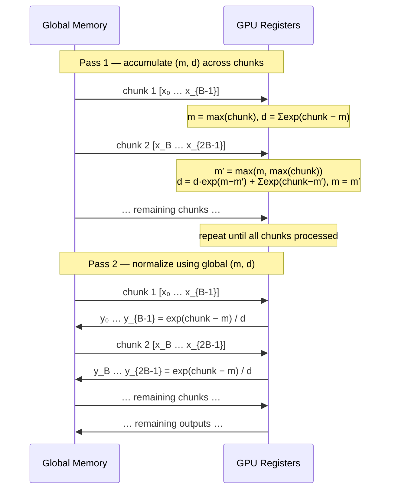

## introduction {#introduction}

in the [fused softmax post](/en/posts/fused-softmax/), we showed that keeping an entire row in GPU SRAM eliminates redundant global memory traffic — reducing softmax from \\(8MN\\) to \\(2MN\\) memory operations. the critical assumption: each row of size \\(N\\) fits in SRAM.

that assumption breaks for large \\(N\\). modern GPUs have between 48 KB and 228 KB of shared memory per SM. for `float32`, a row exceeding ~12K–57K elements won't fit, and the fused approach fails.

**online softmax** solves this by processing rows in fixed-size chunks, maintaining sufficient statistics across chunks to produce the correct result — without ever storing the full row in SRAM and without intermediate global memory writes.

## why the fused kernel fails for large rows {#sram-limit}

the fused kernel allocates a block of size \\(N\\) (rounded to the next power of 2) in SRAM:

```python
BLOCK_SIZE = triton.next_power_of_2(n_cols)   # must fit in SRAM
row = tl.load(row_ptr + tl.arange(0, BLOCK_SIZE), ...)
```

if \\(N = 65536\\) and values are `float32`, that's 256 KB — exceeding the SRAM budget of most GPUs. the fix: process the row in chunks of a fixed, hardware-safe size \\(B\\) and merge per-chunk statistics.

## the three-pass baseline {#three-pass}

numerical stability requires subtracting the row maximum before exponentiation. written explicitly, this is three sequential passes over the data:

\begin{align}
\text{Pass 1:} \quad & m = \max_{i=1}^{N} x_i \\\\
\text{Pass 2:} \quad & d = \sum_{i=1}^{N} \exp(x_i - m) \\\\
\text{Pass 3:} \quad & y_i = \frac{\exp(x_i - m)}{d}
\end{align}

each pass reads \\(N\\) values from global memory, and passes 1 and 2 must be sequential — pass 2 needs \\(m\\) from pass 1.

## merging passes 1 and 2: online statistics {#online-stats}

can we compute \\(m\\) and \\(d\\) simultaneously in a single scan? yes, by maintaining **running statistics** that are updated incrementally as each new element arrives.

define:

\begin{align}
m_j &= \max_{i=1}^{j} x_i \\\\
d_j &= \sum_{i=1}^{j} \exp(x_i - m_j)
\end{align}

the update rule when we encounter \\(x_{j+1}\\):

\begin{align}
m_{j+1} &= \max(m_j,\ x_{j+1}) \\\\
d_{j+1} &= d_j \cdot \exp(m_j - m_{j+1}) + \exp(x_{j+1} - m_{j+1})
\end{align}

the \\(\exp(m_j - m_{j+1})\\) factor **rescales** the previously accumulated denominator to the new, potentially larger max. to verify correctness:

\begin{align}
d_{j+1} &= d_j \cdot \exp(m_j - m_{j+1}) + \exp(x_{j+1} - m_{j+1}) \\\\
         &= \left[\sum_{i=1}^{j} \exp(x_i - m_j)\right] \exp(m_j - m_{j+1}) + \exp(x_{j+1} - m_{j+1}) \\\\
         &= \sum_{i=1}^{j} \exp(x_i - m_{j+1}) + \exp(x_{j+1} - m_{j+1}) \\\\
         &= \sum_{i=1}^{j+1} \exp(x_i - m_{j+1}) \quad \checkmark
\end{align}

after scanning all \\(N\\) elements, \\((m_N,\ d_N)\\) are exactly the global max and denominator. the same update generalizes to **chunks**: replace the element-wise max and exp with block-wise `max` and `sum`.

## the two-pass tiled algorithm {#two-pass}

**pass 1** — scan chunks, maintain \\((m, d)\\). for each chunk \\(C_k = x[kB : (k+1)B]\\):

\begin{align}
m' &= \max\left(m,\ \max(C_k)\right) \\\\
d  &\leftarrow d \cdot \exp(m - m') + \sum_{i \in C_k} \exp(x_i - m') \\\\
m  &\leftarrow m'
\end{align}

**pass 2** — normalize with the global \\((m, d)\\):

\begin{equation}
y_i = \frac{\exp(x_i - m)}{d}
\end{equation}

total memory traffic: \\(2MN\\) reads and \\(MN\\) writes — same as the fused kernel, but \\(N\\) can now be arbitrarily large.

<span class="figure-number">Figure 1: </span>two-pass tiled softmax — pass 1 streams chunks to accumulate global statistics, pass 2 streams again to normalize



## triton kernel {#triton-kernel}

```python
import triton
import triton.language as tl

@triton.jit
def online_softmax_kernel(
    output_ptr, input_ptr,
    input_row_stride, output_row_stride,
    n_rows, n_cols,
    BLOCK_SIZE: tl.constexpr,
):
    row_idx = tl.program_id(0)
    row_in  = input_ptr  + row_idx * input_row_stride
    row_out = output_ptr + row_idx * output_row_stride

    # --- pass 1: accumulate (m, d) over chunks ---
    m = float('-inf')
    d = 0.0

    for block_start in range(0, n_cols, BLOCK_SIZE):
        cols = block_start + tl.arange(0, BLOCK_SIZE)
        mask = cols < n_cols
        x    = tl.load(row_in + cols, mask=mask, other=float('-inf'))

        block_m = tl.max(x, axis=0)
        m_new   = tl.maximum(m, block_m)

        # rescale running denominator, add this block's contribution
        d = d * tl.exp(m - m_new) + tl.sum(tl.exp(x - m_new), axis=0)
        m = m_new

    # --- pass 2: normalize ---
    for block_start in range(0, n_cols, BLOCK_SIZE):
        cols = block_start + tl.arange(0, BLOCK_SIZE)
        mask = cols < n_cols
        x    = tl.load(row_in + cols, mask=mask, other=0.0)
        y    = tl.exp(x - m) / d
        tl.store(row_out + cols, y, mask=mask)


def online_softmax(x: torch.Tensor) -> torch.Tensor:
    assert x.ndim == 2
    n_rows, n_cols = x.shape
    y = torch.empty_like(x)

    # BLOCK_SIZE is fixed and hardware-safe, independent of n_cols
    BLOCK_SIZE = 1024

    online_softmax_kernel[(n_rows,)](
        y, x,
        x.stride(0), y.stride(0),
        n_rows, n_cols,
        BLOCK_SIZE=BLOCK_SIZE,
    )
    return y
```



the key difference from the fused kernel: `BLOCK_SIZE` is now a fixed constant (e.g. 1024), not \\(\lceil N \rceil_2\\). the outer `range` loop handles arbitrary \\(N\\) without allocating \\(O(N)\\) SRAM.



## correctness and numerical stability {#correctness}

online softmax is **mathematically equivalent** to the three-pass algorithm. the rescaling step \\(d \leftarrow d \cdot \exp(m_{\text{old}} - m_{\text{new}})\\) adjusts previous partial sums whenever a new, larger maximum is found, so the final \\((m, d)\\) are identical to what a two-pass algorithm would produce.

crucially, we never compute \\(\exp(x_i)\\) without subtracting a running maximum — numerical stability is preserved throughout.



**edge case**: `other=float('-inf')` in pass 1 ensures out-of-bounds padding elements don't corrupt the max. in pass 2, `other=0.0` is safe because masked positions are never stored.



## connection to flash attention {#flash-attention}

online softmax is the algorithmic core of **Flash Attention** (Dao et al., [arXiv:2205.14135](https://arxiv.org/abs/2205.14135)). attention computes:

\begin{equation}
\text{Attention}(Q, K, V) = \text{softmax}\left(\frac{QK^\top}{\sqrt{d}}\right) V
\end{equation}

the naive approach materializes the full \\(N \times N\\) attention matrix in global memory. flash attention avoids this by tiling over both key and query dimensions, maintaining \\((m, d)\\) incrementally **and** accumulating the output \\(V\\) in the same pass.

when a new chunk of keys arrives, the partial output \\(O_k\\) is rescaled by the same factor \\(\exp(m_{\text{old}} - m_{\text{new}})\\) used to rescale \\(d\\). this collapses what would be a three-pass algorithm into a single fused kernel, regardless of sequence length.

## comparison {#comparison}

| approach | global memory reads | sram per row | handles large \\(N\\)? |
|---|---|---|---|
| naive softmax | \\(5MN + 2M\\) | \\(O(1)\\) | yes |
| fused softmax | \\(MN\\) | \\(O(N)\\) | **no** |
| online softmax | \\(2MN\\) | \\(O(B)\\) | **yes** |

online softmax trades one extra global memory pass for \\(O(B)\\) SRAM — a worthwhile exchange when rows are too large to cache.

## summary {#summary}

- the fused softmax kernel fails when rows exceed SRAM capacity
- **online softmax** maintains running statistics \\((m, d)\\) across chunks using \\(d \leftarrow d \cdot \exp(m_{\text{old}} - m_{\text{new}}) + \sum_{\text{chunk}} \exp(x - m_{\text{new}})\\)
- this reduces the three-pass algorithm to **two global memory passes** with \\(O(B)\\) SRAM regardless of row width
- the same rescaling trick is the foundation of **flash attention**, enabling fused attention over arbitrarily long sequences
