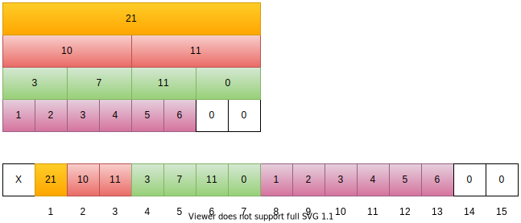
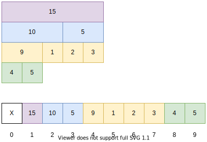

A segment tree is a binary tree where each node represents an interval. Each node stores some property of its corresponding interval: like the maximum/minimum num, the sum of that interval.

<!--more-->

## Applicable Problems

For any array `a`, where every element belongs to some monoid $(S, \oplus)$ we can build a segment tree to answer the following queries (problems):
– `Get(l, r)` — returns $a_l \oplus a_{l+1} \oplus \dotsb a_r$
– `Change(p, x)` — set $a_p = x$



* **Monoids** are semigroups with identity.
* $\oplus$ is an associative binary operation.
* **Identity element** for some pair $(S, \oplus)$ is such an element $e \in S$ that for every $a \in S$ condition $a ⊕ e = e \oplus a = a$ holds;



## Example Problem



[leetcode 307: Range Sum Query - Mutable](https://leetcode.com/problems/range-sum-query-mutable/)
Given an integer array `nums`, find the sum of the elements between indices `i` and `j` (`i ≤ j`), inclusive.
The `update(i, val)` function modifies nums by updating the element at index `i` to `val`.



For this problem, the **identity element** is **0**, and the binary operation is **+** between integers.
~~And for simplicity we use the **identity element** to extend the length of the original array to some integer power of 2.~~



if size of the array is `n`, then we only need an array of `2*n` length to store the segment tree. (property of a [Complete Binary Tree](https://en.wikipedia.org/wiki/Binary_tree#Arrays))



### Define the binary operation

Here we will just use `+` for our operation, you can if you need define a merge function for your special operation $\oplus$.




```C++
inline int merge(int a, int b) {
  return a + b;
}
```




### Build the Tree

We want to construct an array like below (the original array is `{1, 2, 3, 4, 5, 6}`), the essential idea of a segment tree is that a node at index $i$ (index start from 1, you can also try starting from 0) can have two children at indexes $(2 \ast i)$ and $(2 \ast i + 1)$.




```C++
NumArray(vector<int>& nums) {
  n = nums.size();
  segment_tree.resize(2 * n);
  for (int i = 0; i < n; ++i) {
    segment_tree[i + n] = nums[i];
  }
  for (int i = n - 1; i > 0; --i) {
    segment_tree[i] = segment_tree[i << 1] + segment_tree[i << 1 | 1];
  }
}
```




### Query a range sum




```C++
int sumRange(int i, int j) {
  int sum = 0;
  j += 1;
  i += n; j += n;
  while (i < j) {
    if (i&1) {
        sum += segment_tree[i];
        ++i;
    }
    if (j&1) {
        --j;
        sum += segment_tree[j];
    }
    i >>= 1; j >>= 1;
  }
  return sum;
}
```




### Update an element/elements




```C++
void update(int i, int val) {
  i += n;
  if (segment_tree[i] == val) return;
  segment_tree[i] = val;
  while (i > 1) {
    i >>= 1;
    segment_tree[i] = segment_tree[i<<1] + segment_tree[i<<1|1];
  }
}
```




### Complete Solution to the Problem



```C++
class NumArray {
private:
    int n;
    vector<int> segment_tree;
public:
    NumArray(vector<int>& nums) {
        n = nums.size();
        segment_tree.resize(2*n);
        for (int i = 0; i < n; ++i) {
            segment_tree[i+n] = nums[i];
        }
        for (int i = n-1; i > 0; --i) {
            segment_tree[i] = segment_tree[i<<1] + segment_tree[i<<1|1];
        }
    }
    void update(int i, int val) {
        i += n;
        if (segment_tree[i] == val) return;
        segment_tree[i] = val;
        while (i > 1) {
            i >>= 1;
            segment_tree[i] = segment_tree[i<<1] + segment_tree[i<<1|1];
        }
    }
    int sumRange(int i, int j) {
        int sum = 0;
        j += 1;
        i += n; j += n;
        while (i < j) {
            if (i&1) {
                sum += segment_tree[i];
                ++i;
            }
            if (j&1) {
                --j;
                sum += segment_tree[j];
            }
            i >>= 1; j >>= 1;
        }
        return sum;
    }
};
```



## Refs

* [A Recursive approach to Segment Trees, Range Sum Queries & Lazy Propagation](https://leetcode.com/articles/a-recursive-approach-to-segment-trees-range-sum-queries-lazy-propagation/)
* [Segment tree Theory and applications](http://maratona.ic.unicamp.br/MaratonaVerao2016/material/segment_tree_lecture.pdf)
* [wiki: binary tree - in an array](https://en.wikipedia.org/wiki/Binary_tree#Arrays)
