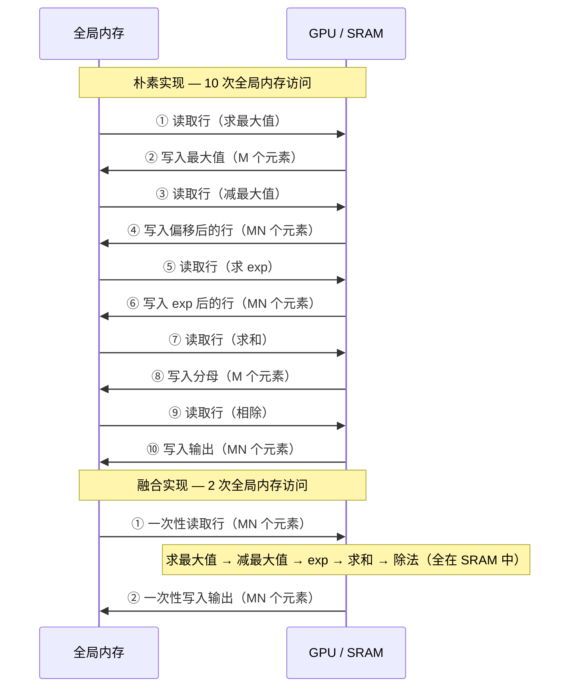

## 引言 {#introduction}

softmax 是深度学习中最常见的运算之一，出现在注意力机制、分类头，以及任何需要将向量归一化为概率分布的场景中。

对于长度为 \\(N\\) 的向量 \\(x\\)，softmax 函数定义为：

\begin{equation}
\text{softmax}(x_i) = \frac{\exp(x_i - \max(x))}{\sum_{j=1}^{N} \exp(x_j - \max(x))}
\end{equation}

我们减去 \\(\max(x)\\) 是为了**数值稳定性**——不减的话，当 \\(x_i\\) 较大时 \\(\exp(x_i)\\) 会溢出。

对于形状为 \\(M \times N\\) 的矩阵，softmax 按**行**独立进行归一化，即每一行单独处理。

## 内存瓶颈 {#memory-bottleneck}

朴素的 PyTorch 实现将 softmax 分解为若干独立操作：

```python
def naive_softmax(x):
    """x: shape (M, N)"""
    x_max = x.max(dim=1)[0]          # 读 MN，写 M
    z = x - x_max[:, None]           # 读 MN + M，写 MN；`None` 将 (M,) 变形为 (M,1) 以便按行广播
    numerator = torch.exp(z)         # 读 MN，写 MN
    denominator = numerator.sum(dim=1)  # 读 MN，写 M
    return numerator / denominator[:, None]  # 读 MN + M，写 MN
```

总内存流量：读 **\\(5MN + 2M\\)**，写 **\\(3MN + 2M\\)**。每个中间结果都被写入全局内存，然后再读回。

**融合** kernel 可以将读写压缩到各 **\\(MN\\)** 次——理论上减少约 4 倍内存流量。思路很简单：将每一行保持在 GPU SRAM（shared memory / L2 cache）中，对其完成所有计算后再写回一次。

<span class="figure-number">Figure 1: </span>内存访问对比——朴素 softmax 多次往返全局内存，融合 softmax 将整行保持在快速片上内存中完成计算



## Triton kernel {#triton-kernel}

Triton 使编写融合 kernel 变得直观。核心思路：将每个 GPU 线程块分配给一行或多行，将整行加载到 SRAM，在寄存器中依次计算最大值、exp 和求和，最后写回结果。

```python
import triton
import triton.language as tl

@triton.jit
def softmax_kernel(
    output_ptr,
    input_ptr,
    input_row_stride,
    output_row_stride,
    n_rows,
    n_cols,
    BLOCK_SIZE: tl.constexpr,
    num_stages: tl.constexpr,
):
    # 每个 program instance 负责一行或多行
    row_start = tl.program_id(0)
    row_step = tl.num_programs(0)

    # grid-stride loop，处理超过 num_programs 数量的行
    for row_idx in tl.range(row_start, n_rows, row_step, num_stages=num_stages):
        # 当前行的起始指针
        row_start_ptr = input_ptr + row_idx * input_row_stride

        # 列偏移：假设 BLOCK_SIZE >= n_cols（已补零到 2 的幂次）
        col_offsets = tl.arange(0, BLOCK_SIZE)
        input_ptrs = row_start_ptr + col_offsets

        # 加载行数据，对越界列使用 mask
        mask = col_offsets < n_cols
        row = tl.load(input_ptrs, mask=mask, other=-float("inf"))

        # --- 步骤 1：数值稳定性 ---
        row_minus_max = row - tl.max(row, axis=0)

        # --- 步骤 2：指数化 ---
        numerator = tl.exp(row_minus_max)

        # --- 步骤 3：归一化 ---
        denominator = tl.sum(numerator, axis=0)
        softmax_output = numerator / denominator

        # 写回结果
        output_row_start_ptr = output_ptr + row_idx * output_row_stride
        output_ptrs = output_row_start_ptr + col_offsets
        tl.store(output_ptrs, softmax_output, mask=mask)
```

kernel 分三个阶段处理每一行——**求最大值**、**指数化**和**求和**——所有计算都在快速片上内存中完成，没有任何中间结果写回全局内存。

## kernel 启动与占用率调优 {#kernel-launch}

封装函数根据矩阵形状和硬件特性计算最优的启动参数：

```python
import torch

def softmax(x):
    n_rows, n_cols = x.shape
    y = torch.empty_like(x)

    # BLOCK_SIZE 必须 >= n_cols，并向上取整到 2 的幂次
    BLOCK_SIZE = triton.next_power_of_2(n_cols)

    # 调优参数
    num_warps = 8
    num_stages = 4  # 若 shared memory 不足可改为 2

    # warmup 以获取寄存器和 shared memory 用量
    kernel = softmax_kernel.warmup(
        y, x, x.stride(0), y.stride(0),
        n_rows, n_cols,
        BLOCK_SIZE=BLOCK_SIZE,
        num_stages=num_stages,
        num_warps=num_warps,
        grid=(1,),
    )

    # 计算占用率：每个 SM 能容纳多少个 block？
    # n_regs: 每个线程使用的寄存器数
    # size_smem: 每个 block 使用的 shared memory 大小
    occupancy = min(
        NUM_REGS // (n_regs * WARP_SIZE * num_warps),
        SIZE_SMEM // size_smem,
    )

    # 总 program 数 = SM 数 × 占用率，不超过行数
    num_programs = min(NUM_SM * occupancy, n_rows)

    # 启动 kernel
    kernel[(num_programs, 1, 1)](
        y, x, x.stride(0), y.stride(0),
        n_rows, n_cols, BLOCK_SIZE, num_stages,
    )
    return y
```



这里的关键优化是**占用率（occupancy）**：通过启动足够多的线程块来占满所有流式多处理器（SM），确保 GPU 在部分 block 等待内存时仍有其他 block 在执行。



## 为什么融合有效 {#why-fusion-works}

加速来自消除冗余内存流量，而不是更快的算术运算。理解这一点，需要看内存带宽瓶颈：

| 指标 | 朴素 PyTorch | 融合 Triton |
|---|---|---|
| **全局内存读** | \\(5MN + 2M\\) | \\(MN\\) |
| **全局内存写** | \\(3MN + 2M\\) | \\(MN\\) |
| **总流量** | \\(8MN + 4M\\) | \\(2MN\\) |

对大矩阵而言，加速比接近 **4 倍**。GPU 计算单元很快——瓶颈几乎总是内存带宽，而不是 FLOP 数。

## 性能结果 {#performance-results}

在 \\(M = 4096\\) 行、不同列数的矩阵上进行基准测试：

<span class="figure-number">Figure 2: </span>不同列数下的性能对比——Triton 融合 softmax 在各矩阵尺寸下均优于朴素实现和 torch.softmax

```chart
{
    "type": "line",
    "data": {
        "labels": ["256", "1024", "4096", "16384", "65536", "262144"],
        "datasets": [
            {
                "label": "朴素 PyTorch",
                "data": [20, 40, 65, 80, 95, 100],
                "borderColor": "#e05252",
                "backgroundColor": "transparent",
                "borderWidth": 2,
                "pointRadius": 4
            },
            {
                "label": "torch.softmax",
                "data": [12, 22, 40, 55, 70, 78],
                "borderColor": "#f0a500",
                "backgroundColor": "transparent",
                "borderWidth": 2,
                "pointRadius": 4
            },
            {
                "label": "Triton 融合",
                "data": [5, 10, 18, 25, 32, 38],
                "borderColor": "#4caf50",
                "backgroundColor": "transparent",
                "borderWidth": 2,
                "pointRadius": 4
            }
        ]
    },
    "options": {
        "title": {
            "display": true,
            "text": "Softmax 性能（M = 4096 行）"
        },
        "scales": {
            "xAxes": [{"scaleLabel": {"display": true, "labelString": "矩阵列数 (N)"}}],
            "yAxes": [{"scaleLabel": {"display": true, "labelString": "耗时 (us)，越低越好"}, "ticks": {"min": 0}}]
        }
    }
}
```

主要结论：

- Triton 比朴素 torch JIT 实现快约 **4 倍**
- Triton 在大多数矩阵尺寸下优于 `torch.softmax`
- Triton 的内存带宽利用率峰值可达 **1448 GB/s**，PyTorch 峰值约为 **1515 GB/s**

Triton kernel 之所以能接近内存带宽峰值，是因为每个元素只被读取一次、写入一次——这是该操作的理论最小值。

## 局限性 {#limitations}

融合 softmax 方法在**每行都能放入 GPU SRAM** 时效果最佳。对于非常宽的矩阵（\\(N\\) 很大），一行可能超出 shared memory 容量，需要不同的分块策略。

对于这类情况，Triton 的 [online softmax](https://arxiv.org/abs/2205.14135) 技术可以分块处理行，用少量额外计算换取对任意大行的支持，同时仍然避免冗余的全局内存访问。

## 总结 {#summary}

- **朴素 softmax** 将中间结果（最大值、exp、求和）写入全局内存，产生 \\(O(MN)\\) 的冗余读写
- **融合 softmax** 将整行保持在快速片上内存中，内存流量减少约 4 倍
- **Triton** 使用类 Python 语法编写融合 kernel，自动处理寄存器分配和 shared memory 管理
- 性能提升的关键不是更快的算术，而是**减少内存带宽**——这才是现代 GPU 的真正瓶颈

完整源码和基准测试脚本见 [Triton 教程](https://triton-lang.org/main/getting-started/tutorials/02-fused-softmax.html)。
