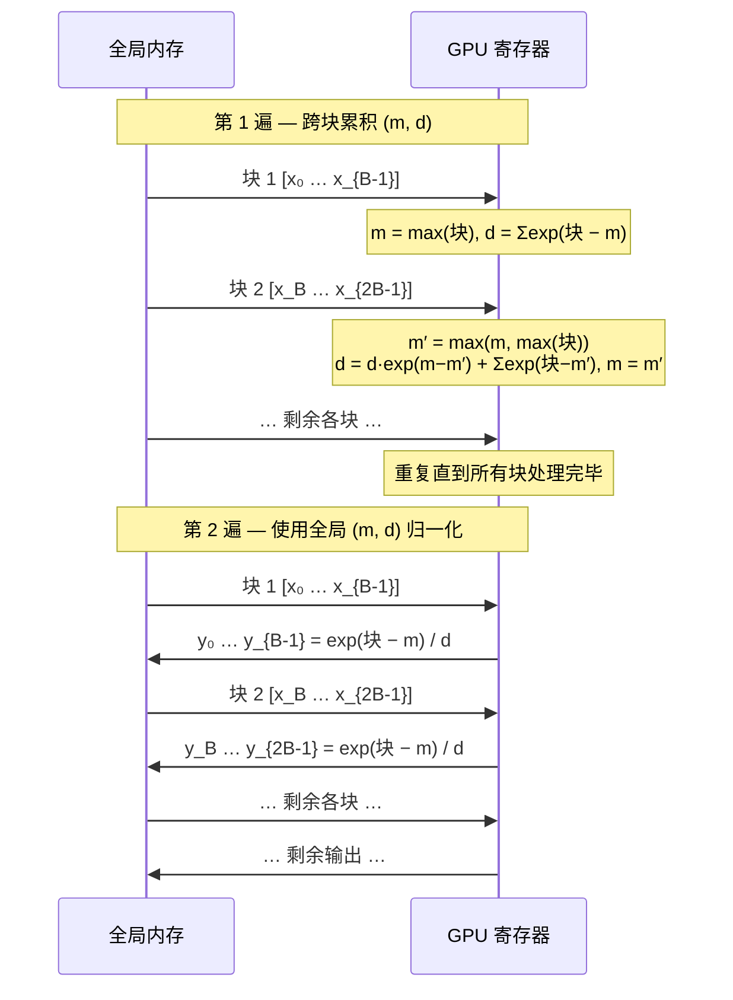

## 引言 {#introduction}

在[融合 softmax 一文](/zh/posts/fused-softmax/)中，我们展示了将整行保持在 GPU SRAM 中可以消除冗余全局内存流量——将 softmax 的内存操作从 \\(8MN\\) 降至 \\(2MN\\)。这背后有一个关键假设：大小为 \\(N\\) 的每一行能放入 SRAM。

当 \\(N\\) 较大时，这个假设就会被打破。现代 GPU 每个 SM 的 shared memory 在 48 KB 到 228 KB 之间。对于 `float32`，超过约 12K–57K 个元素的行就无法放入，融合方法也随之失效。

**online softmax** 通过以固定大小的块处理行来解决这个问题——在块间维护足够的统计量以产生正确结果，既无需将整行存入 SRAM，也不产生中间全局内存写入。

## 为什么融合 kernel 对大行失效 {#sram-limit}

融合 kernel 在 SRAM 中分配大小为 \\(N\\)（向上取整到 2 的幂次）的块：

```python
BLOCK_SIZE = triton.next_power_of_2(n_cols)   # 必须能放入 SRAM
row = tl.load(row_ptr + tl.arange(0, BLOCK_SIZE), ...)
```

若 \\(N = 65536\\) 且值为 `float32`，则需要 256 KB——超过大多数 GPU 的 SRAM 预算。解决方案：以固定的、硬件安全的大小 \\(B\\) 分块处理行，并合并各块的统计量。

## 三遍基线算法 {#three-pass}

数值稳定性要求在指数化前减去行最大值。显式写出来，这需要对数据进行三次顺序扫描：

\begin{align}
\text{第 1 遍：} \quad & m = \max_{i=1}^{N} x_i \\\\
\text{第 2 遍：} \quad & d = \sum_{i=1}^{N} \exp(x_i - m) \\\\
\text{第 3 遍：} \quad & y_i = \frac{\exp(x_i - m)}{d}
\end{align}

每遍从全局内存读取 \\(N\\) 个值，且第 1 遍和第 2 遍必须串行——第 2 遍需要第 1 遍的 \\(m\\)。

## 合并第 1 遍和第 2 遍：在线统计量 {#online-stats}

能否在一次扫描中同时计算 \\(m\\) 和 \\(d\\)？可以——通过维护**滚动统计量**，在每个新元素到达时增量更新。

定义：

\begin{align}
m_j &= \max_{i=1}^{j} x_i \\\\
d_j &= \sum_{i=1}^{j} \exp(x_i - m_j)
\end{align}

当遇到 \\(x_{j+1}\\) 时的更新规则：

\begin{align}
m_{j+1} &= \max(m_j,\ x_{j+1}) \\\\
d_{j+1} &= d_j \cdot \exp(m_j - m_{j+1}) + \exp(x_{j+1} - m_{j+1})
\end{align}

其中 \\(\exp(m_j - m_{j+1})\\) 这一因子**重新缩放**了先前累积的分母，以适应新的、可能更大的最大值。验证其正确性：

\begin{align}
d_{j+1} &= d_j \cdot \exp(m_j - m_{j+1}) + \exp(x_{j+1} - m_{j+1}) \\\\
         &= \left[\sum_{i=1}^{j} \exp(x_i - m_j)\right] \exp(m_j - m_{j+1}) + \exp(x_{j+1} - m_{j+1}) \\\\
         &= \sum_{i=1}^{j} \exp(x_i - m_{j+1}) + \exp(x_{j+1} - m_{j+1}) \\\\
         &= \sum_{i=1}^{j+1} \exp(x_i - m_{j+1}) \quad \checkmark
\end{align}

扫描所有 \\(N\\) 个元素后，\\((m_N,\ d_N)\\) 精确等于全局最大值和分母。同样的更新规则可以推广到**块**：将逐元素的 max 和 exp 替换为块级的 `max` 和 `sum`。

## 两遍分块算法 {#two-pass}

**第 1 遍** — 扫描各块，维护 \\((m, d)\\)。对于每个块 \\(C_k = x[kB : (k+1)B]\\)：

\begin{align}
m' &= \max\left(m,\ \max(C_k)\right) \\\\
d  &\leftarrow d \cdot \exp(m - m') + \sum_{i \in C_k} \exp(x_i - m') \\\\
m  &\leftarrow m'
\end{align}

**第 2 遍** — 用全局 \\((m, d)\\) 归一化：

\begin{equation}
y_i = \frac{\exp(x_i - m)}{d}
\end{equation}

总内存流量：读 \\(2MN\\)，写 \\(MN\\)——与融合 kernel 相同，但 \\(N\\) 现在可以任意大。

<span class="figure-number">Figure 1: </span>两遍分块 softmax——第 1 遍流式处理各块以累积全局统计量，第 2 遍再次流式处理以归一化



## Triton kernel {#triton-kernel}

```python
import triton
import triton.language as tl

@triton.jit
def online_softmax_kernel(
    output_ptr, input_ptr,
    input_row_stride, output_row_stride,
    n_rows, n_cols,
    BLOCK_SIZE: tl.constexpr,
):
    row_idx = tl.program_id(0)
    row_in  = input_ptr  + row_idx * input_row_stride
    row_out = output_ptr + row_idx * output_row_stride

    # --- 第 1 遍：跨块累积 (m, d) ---
    m = float('-inf')
    d = 0.0

    for block_start in range(0, n_cols, BLOCK_SIZE):
        cols = block_start + tl.arange(0, BLOCK_SIZE)
        mask = cols < n_cols
        x    = tl.load(row_in + cols, mask=mask, other=float('-inf'))

        block_m = tl.max(x, axis=0)
        m_new   = tl.maximum(m, block_m)

        # 重新缩放滚动分母，加上当前块的贡献
        d = d * tl.exp(m - m_new) + tl.sum(tl.exp(x - m_new), axis=0)
        m = m_new

    # --- 第 2 遍：归一化 ---
    for block_start in range(0, n_cols, BLOCK_SIZE):
        cols = block_start + tl.arange(0, BLOCK_SIZE)
        mask = cols < n_cols
        x    = tl.load(row_in + cols, mask=mask, other=0.0)
        y    = tl.exp(x - m) / d
        tl.store(row_out + cols, y, mask=mask)


def online_softmax(x: torch.Tensor) -> torch.Tensor:
    assert x.ndim == 2
    n_rows, n_cols = x.shape
    y = torch.empty_like(x)

    # BLOCK_SIZE 是固定的硬件安全常量，与 n_cols 无关
    BLOCK_SIZE = 1024

    online_softmax_kernel[(n_rows,)](
        y, x,
        x.stride(0), y.stride(0),
        n_rows, n_cols,
        BLOCK_SIZE=BLOCK_SIZE,
    )
    return y
```



与融合 kernel 的关键区别：`BLOCK_SIZE` 现在是固定常量（如 1024），而不是 \\(\lceil N \rceil_2\\)。外层 `range` 循环处理任意大的 \\(N\\)，无需分配 \\(O(N)\\) 的 SRAM。



## 正确性与数值稳定性 {#correctness}

online softmax 在数学上等价于三遍算法。重新缩放步骤 \\(d \leftarrow d \cdot \exp(m_{\text{旧}} - m_{\text{新}})\\) 在发现新的更大最大值时调整之前的部分和，因此最终的 \\((m, d)\\) 与两遍算法产生的结果完全一致。

关键是：我们从不在没有减去滚动最大值的情况下计算 \\(\exp(x_i)\\)——数值稳定性在整个过程中得到保证。



**边界情况**：第 1 遍中 `other=float('-inf')` 确保越界的填充元素不会污染最大值。第 2 遍中 `other=0.0` 是安全的，因为被 mask 的位置不会被写入。



## 与 Flash Attention 的联系 {#flash-attention}

online softmax 是 **Flash Attention**（Dao 等，[arXiv:2205.14135](https://arxiv.org/abs/2205.14135)）的算法核心。注意力计算为：

\begin{equation}
\text{Attention}(Q, K, V) = \text{softmax}\left(\frac{QK^\top}{\sqrt{d}}\right) V
\end{equation}

朴素方法会将完整的 \\(N \times N\\) 注意力矩阵实体化到全局内存中。Flash Attention 通过在键和查询两个维度上分块来避免这一点，在同一遍中增量维护 \\((m, d)\\) **并**累积输出 \\(V\\)。

当新的键块到达时，部分输出 \\(O_k\\) 用与重新缩放 \\(d\\) 相同的因子 \\(\exp(m_{\text{旧}} - m_{\text{新}})\\) 进行缩放。这将原本三遍的算法压缩为一个融合 kernel，无论序列长度多长都能适用。

## 对比 {#comparison}

| 方法 | 全局内存读 | 每行 SRAM | 支持大 \\(N\\)？ |
|---|---|---|---|
| 朴素 softmax | \\(5MN + 2M\\) | \\(O(1)\\) | 是 |
| 融合 softmax | \\(MN\\) | \\(O(N)\\) | **否** |
| online softmax | \\(2MN\\) | \\(O(B)\\) | **是** |

online softmax 用一次额外的全局内存遍历换取 \\(O(B)\\) 的 SRAM——在行太大无法缓存时，这是值得的交换。

## 总结 {#summary}

- 融合 softmax kernel 在行超过 SRAM 容量时失效
- **online softmax** 使用 \\(d \leftarrow d \cdot \exp(m_{\text{旧}} - m_{\text{新}}) + \sum_{\text{块}} \exp(x - m_{\text{新}})\\) 跨块维护滚动统计量 \\((m, d)\\)
- 这将三遍算法压缩为**两遍全局内存访问**，SRAM 用量降至 \\(O(B)\\)，与行宽无关
- 同样的重新缩放技巧是 **Flash Attention** 的基础，使任意长序列的融合注意力成为可能
